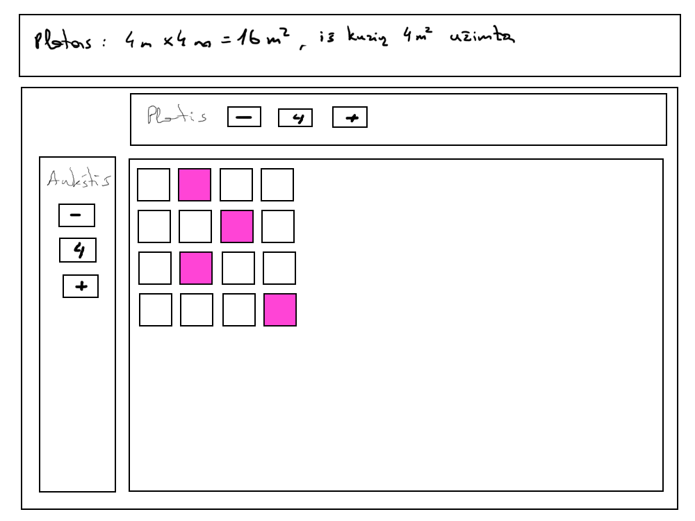

# Plotas

## Reikalavimai dizainui

-   
-   per visą ekraną
-   pagrindinės matricos langeliai fiksuoto dydžio (3rem x 3rem)
-   tarpas tarp langelių yra 0,3rem

## Techniniai reikalavimai

-   viršuje yra suvestinė žemiau esančių parametrų:
    -   viso turimo ploto
    -   pažymėtų langelių plotas (kai kiekvienas jų laikoma esant 1 kv. metras)
-   aukštis ir plotis reguliuojasi mygtukais
-   papildomi stulpeliai atsiranda dešinėje
-   papildomos eilutės atsiranda apačioje
-   stulpeliai pašalinami iš dešinės
-   eilutės pašalinamos iš apačios
-   spaudžiant ant matricos langelių jie pažymimi/atžymimi
-   šalia matricos esančiose dalyse su mygtukais kartu yra atvaizduojami jų eilučių/stulpelių kiekiai
-   pradydis dydis yra 1x1
-   sugeneravus langelius jie būna nepažymėti